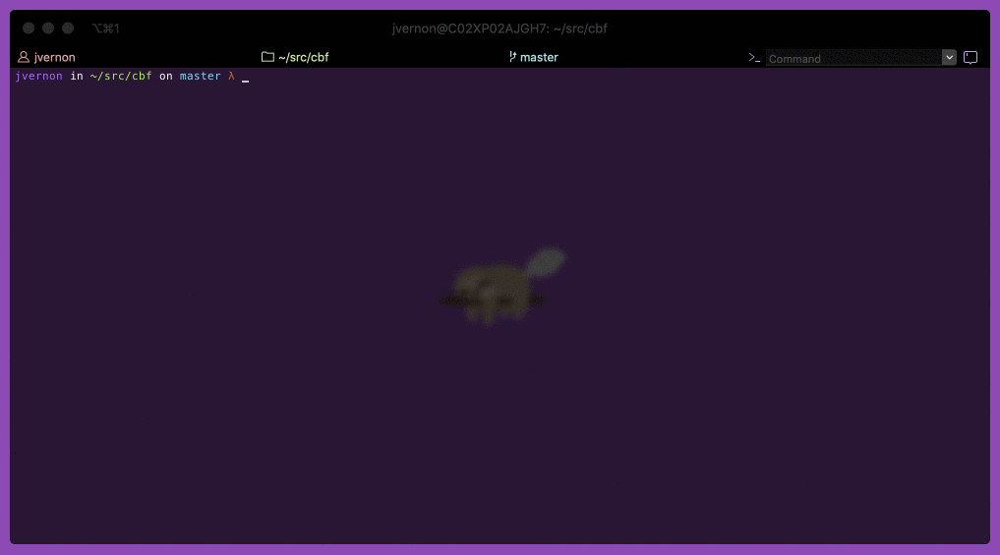

# [CBF](https://joshuatvernon.github.io/cbf-site/) 🦥


[](https://badge.fury.io/js/cbf) [](https://travis-ci.com/joshuatvernon/cbf) [](https://snyk.io/test/github/joshuatvernon/cbf)

__CBF__ 🦥is a simple CLI tool for developers who _can't be f#@!'d_ learning or remembering all the commands they have to run day to day or just in a specific repo.



Developers build scripts that can either be saved directly to __CBF__ or loaded on the fly from a local `cbf.yml` file. The script will then serve as living, breathing runnable documentation for new starters, infrequent contributors or just developers who _can't be f#@!'d_ learning or remembering all the commands.

Check out the [wiki](https://github.com/joshuatvernon/cbf/wiki) to get started!

### Installation

```sh
npm i cbf -g
```
or
```sh
yarn global add cbf
```

### Scripts

#### Simple scripts

__CBF__ simple scripts can be stored as `json` or `yaml` files but must end with either `.simple.json` or `.simple.yml` so __CBF__ knows to parse them differently than advanced scripts. 

Simple scripts are made up of _options_ and _commands_.
1. The first tag is required and is the scripts name
2. _options_ are stored as keys
3. _commands_ are stored as values

_Note: If you would like to customise_ `directories`, `messages` _or_ `variables` _passed to_ each `command` _please use [advanced scripts](#advanced-scripts)._

###### Example simple yaml script

```yaml
hello:
  world: "echo 'Hello, world!'"
  mars: "echo 'Hello, mars!'"
  jupiter: "echo 'Hello, jupiter!'"
```

###### Example simple json script

```json
{
  "hello": {
    "world": "echo 'Hello, world!",
    "mars": "echo 'Hello, mars!",
    "jupiter": "echo 'Hello, jupiter!"
  }
}
```

You can fine more example simple scripts [here](./examples/simple).

#### Advanced scripts

__CBF__ advanced scripts can be stored as `json` or `yaml` files. Advanced scripts are made up of `options`, `command`, `variables`, `message` and `directory` tags that are used to construct the layout of the script.

1. The first tag is required and is the scripts name
2. `options` tags are used to store lists of more `options` or `command`'s
3. `command` tags are used to store one or many strings containing shell commands
4. `variables` tags are used to prompt the user for variables to be replaced in a command 
5. `message` tags are used to store messages that are printed to stdout when an option or command is selected
6. `directory` tags are used to set where a command should be ran. When a command is ran, __CBF__ recursively searches for the commands set directory or closest set parent `directory` tag

###### Example advanced yaml script

```yml
example-project:
    message: "Run, build or test example project?"
    directory: "~/projects/example"
    options:
        run:
            message: "Running example project..."
            command: "yarn start"
        build:
            directory: "~/projects/example/src"
            message: "Building example project..."
            command: "yarn install"
        test:
            message: "Run unit or integration tests?"
            options:
                unit:
                    message: "Running example project unit tests"
                    command: "yarn test:unit"
                integration:
                    message: "Running example project integration tests"
                    command: "yarn test:integration"
```

###### Example advanced json script

```json
{
  "example-project": {
    "message": "Run, build or test example project?",
    "directory": "~/projects/example",
    "options": {
      "run": {
        "message": "Running example project...",
        "command": "yarn start"
      },
      "build": {
        "directory": "~/projects/example/src",
        "message": "Building example project...",
        "command": "yarn install"
      },
      "test": {
        "message": "Run unit or integration tests?",
        "options": {
          "unit": {
            "message": "Running example project unit tests",
            "command": "yarn test:unit"
          },
          "integration": {
            "message": "Running example project integration tests",
            "command": "yarn test:integration"
          }     
        }
      }
    }
  }
}
```

You can fine more example advanced scripts [here](./examples/advanced).

### Local CBF file

Commit a `cbf.yml` to your repository so developers can run `cbf` or `cbf -d` to easily run and view commands related to the repository.

### Package.json

_Can't be f#@!'d_ writing a __CBF__ script? Well guess what? You can just run `cbf` or `cbf -d` to easily run and view commands saved in the `scripts` section of your repos `package.json` file.

_Note: If there is a local `cbf.yml` file it will always instead of a `package.json` file when just using `cbf` or `cbf -d`. However, you can manually choose to run the `scripts` from a `package.json` by running `cbf -j` or `cbf -dj`._

### Usage

```
λ cbf -h

Usage: cbf [options]

cbf is a simple CLI tool for developers who can't be f#@!'d learning or remembering commands.

Go to https://github.com/joshuatvernon/cbf to learn how to make cbf scripts.

Options:
  -V, --version                     output the version number
  -D, --delete [script name]        delete a previously saved script
  -A, --delete-all                  delete all previously saved scripts
  -d, --documented                  prepends the command to the questions when running a script
  -R, --dry-run                     prints the command that would have been run to stdout
  -j, --json                        run scripts in a package json file
  -l, --list                        list previously saved scripts
  -p, --print [script name]         print a saved script
  -r, --run [script name]           run a previously saved script
  -s, --save <path to script file>  process and save a script from a yaml or json file
  -S, --shell                       set which shell commands should be run within
  -h, --help                        output usage information
```

### Copyright
MIT
